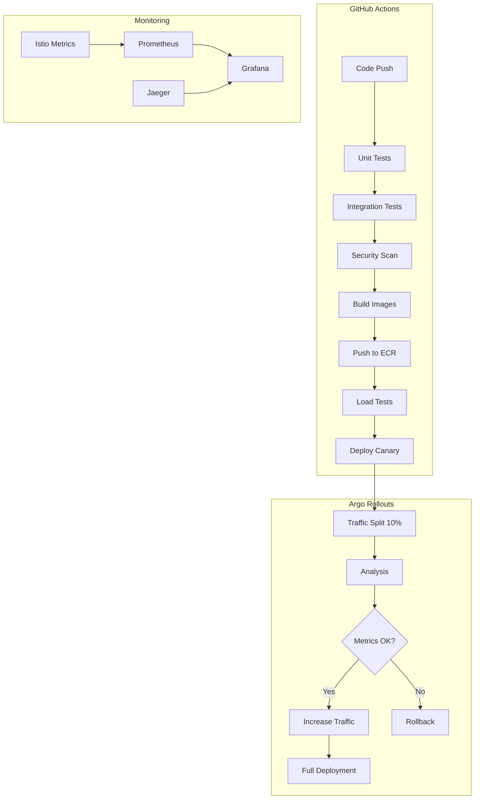

# CI/CD Pipeline with Canary Deployments

This document describes the comprehensive CI/CD pipeline implementation for the AWS deployment system, featuring automated testing, security scanning, canary deployments, and automated rollback capabilities.

## Overview

The CI/CD pipeline is built using:
- **GitHub Actions** for continuous integration and deployment
- **Argo Rollouts** for canary deployments with automated analysis
- **Istio** for traffic routing and observability
- **Prometheus** for metrics collection and analysis
- **k6** for load testing

## Pipeline Architecture



## Components

### 1. GitHub Actions Workflow

The main workflow (`.github/workflows/ci-cd.yml`) includes:

#### Jobs:
- **test**: Runs unit and integration tests
- **security-scan**: Performs vulnerability scanning with Trivy
- **build-and-push**: Builds Docker images and pushes to ECR
- **load-test**: Executes performance tests with k6
- **deploy-staging**: Deploys to staging environment
- **deploy-production**: Initiates canary deployment to production

#### Key Features:
- Multi-service builds (API, Media, Worker services)
- Parallel execution for faster builds
- Security scanning at multiple stages
- Environment-specific deployments
- Automated rollback on failure

### 2. Docker Images

Three optimized Docker images:

#### API Service (`docker/api-service.Dockerfile`)
- Node.js 18 Alpine base
- Multi-stage build for smaller images
- Non-root user for security
- Health checks included

#### Media Service (`docker/media-service.Dockerfile`)
- Go 1.21 Alpine base
- Includes FFmpeg and ImageMagick
- Optimized for media processing

#### Worker Service (`docker/worker-service.Dockerfile`)
- Node.js 18 Alpine base
- Media processing dependencies
- Queue processing optimizations

### 3. Argo Rollouts Configuration

#### Canary Strategy
```yaml
strategy:
  canary:
    steps:
    - setWeight: 10   # Start with 10% traffic
    - pause: 2m       # Wait 2 minutes
    - setWeight: 25   # Increase to 25%
    - pause: 5m       # Wait 5 minutes
    - setWeight: 50   # Increase to 50%
    - pause: 10m      # Wait 10 minutes
    - setWeight: 75   # Increase to 75%
    - pause: 5m       # Final wait
```

#### Automated Analysis
- **Success Rate**: Must be ≥ 99%
- **P99 Latency**: Must be ≤ 200ms
- **Error Rate**: Must be ≤ 1%
- **CPU Usage**: Must be ≤ 80%
- **Memory Usage**: Must be ≤ 80%

#### Traffic Routing
Uses Istio for intelligent traffic splitting:
- Gradual traffic increase based on analysis results
- Automatic rollback on metric violations
- Circuit breaker patterns for resilience

### 4. Load Testing

#### API Load Test (`tests/load/api-load-test.js`)
- Simulates realistic user behavior
- Tests multiple endpoints with different weights
- Validates response times and error rates
- Scales from 100 to 1000 concurrent users

#### Media Upload Test (`tests/load/media-upload-test.js`)
- Tests presigned URL generation
- Validates S3 upload flows
- Tests multipart uploads for large files
- Monitors upload success rates

### 5. Monitoring and Observability

#### Grafana Dashboards
- **Argo Rollouts Dashboard**: Monitors deployment progress
- **CI/CD Metrics Dashboard**: Tracks pipeline performance
- **Service Health Dashboard**: Application metrics

#### Key Metrics
- Deployment frequency
- Lead time for changes
- Mean time to recovery (MTTR)
- Change failure rate

## Usage

### Triggering Deployments

#### Automatic Deployment
```bash
# Push to main branch triggers production canary deployment
git push origin main

# Push to develop branch triggers staging deployment
git push origin develop
```

#### Manual Deployment
```bash
# Deploy specific image tag
./scripts/deploy-canary.sh deploy v1.2.3

# Check deployment status
./scripts/deploy-canary.sh status

# Promote a service manually
./scripts/deploy-canary.sh promote api-service

# Rollback a service
./scripts/deploy-canary.sh rollback api-service
```

### Running Tests Locally

#### Unit Tests
```bash
npm run test:unit
```

#### Integration Tests
```bash
npm run test:integration
```

#### Load Tests
```bash
# API load test
npm run test:load

# Media upload load test
npm run test:load:media
```

### Monitoring Deployments

#### Argo Rollouts CLI
```bash
# Watch rollout progress
kubectl argo rollouts get rollout api-service -w

# Promote rollout
kubectl argo rollouts promote api-service

# Abort rollout
kubectl argo rollouts abort api-service

# Rollback
kubectl argo rollouts undo api-service
```

#### Grafana Dashboards
- Access Grafana at `https://grafana.your-domain.com`
- View "Argo Rollouts - Canary Deployments" dashboard
- Monitor "CI/CD Pipeline Metrics" dashboard

## Security Features

### Image Security
- Vulnerability scanning with Trivy
- Non-root containers
- Read-only root filesystems
- Minimal base images (Alpine)

### Runtime Security
- Pod Security Standards enforcement
- Network policies with Istio
- RBAC for service accounts
- Secrets management with AWS Secrets Manager

### Supply Chain Security
- Signed container images
- SBOM (Software Bill of Materials) generation
- Dependency vulnerability scanning
- License compliance checking

## Troubleshooting

### Common Issues

#### Build Failures
```bash
# Check GitHub Actions logs
# Navigate to Actions tab in GitHub repository

# Local debugging
docker build -f docker/api-service.Dockerfile .
```

#### Deployment Failures
```bash
# Check rollout status
kubectl argo rollouts get rollout api-service

# View pod logs
kubectl logs -l app=api-service -n production

# Check analysis results
kubectl get analysisrun -n production
```

#### Performance Issues
```bash
# Run load tests
k6 run tests/load/api-load-test.js

# Check metrics in Grafana
# Look for high latency or error rates
```

### Rollback Procedures

#### Automatic Rollback
- Triggered when analysis metrics fail
- Happens within 30 seconds of detection
- Traffic immediately routed to stable version

#### Manual Rollback
```bash
# Emergency rollback
./scripts/deploy-canary.sh rollback api-service

# Or using kubectl
kubectl argo rollouts abort api-service
kubectl argo rollouts undo api-service
```

## Best Practices

### Development Workflow
1. Create feature branch from `develop`
2. Write tests for new functionality
3. Ensure all tests pass locally
4. Create pull request to `develop`
5. Merge to `develop` triggers staging deployment
6. Merge to `main` triggers production canary

### Deployment Guidelines
- Always test in staging first
- Monitor metrics during canary phases
- Have rollback plan ready
- Communicate deployments to team
- Document any manual interventions

### Performance Optimization
- Keep Docker images small
- Use multi-stage builds
- Implement proper caching strategies
- Monitor resource usage
- Optimize database queries

## Metrics and SLOs

### Service Level Objectives (SLOs)
- **Availability**: 99.99% uptime
- **Latency**: P99 ≤ 200ms for GET requests
- **Error Rate**: ≤ 0.1% for all requests
- **Deployment Success**: ≥ 95% success rate

### Key Performance Indicators (KPIs)
- **Deployment Frequency**: Daily deployments
- **Lead Time**: < 2 hours from commit to production
- **MTTR**: < 15 minutes for rollbacks
- **Change Failure Rate**: < 5%

## Future Enhancements

### Planned Features
- Blue-green deployment option
- Feature flags integration
- Chaos engineering tests
- Multi-region deployments
- Advanced security scanning

### Continuous Improvement
- Regular pipeline performance reviews
- Metric threshold adjustments
- Tool upgrades and optimizations
- Team feedback incorporation

## Support and Documentation

### Resources
- [Argo Rollouts Documentation](https://argoproj.github.io/argo-rollouts/)
- [Istio Traffic Management](https://istio.io/latest/docs/concepts/traffic-management/)
- [k6 Load Testing](https://k6.io/docs/)
- [GitHub Actions](https://docs.github.com/en/actions)

### Team Contacts
- **DevOps Team**: devops@company.com
- **Platform Team**: platform@company.com
- **On-call**: Use PagerDuty for emergencies