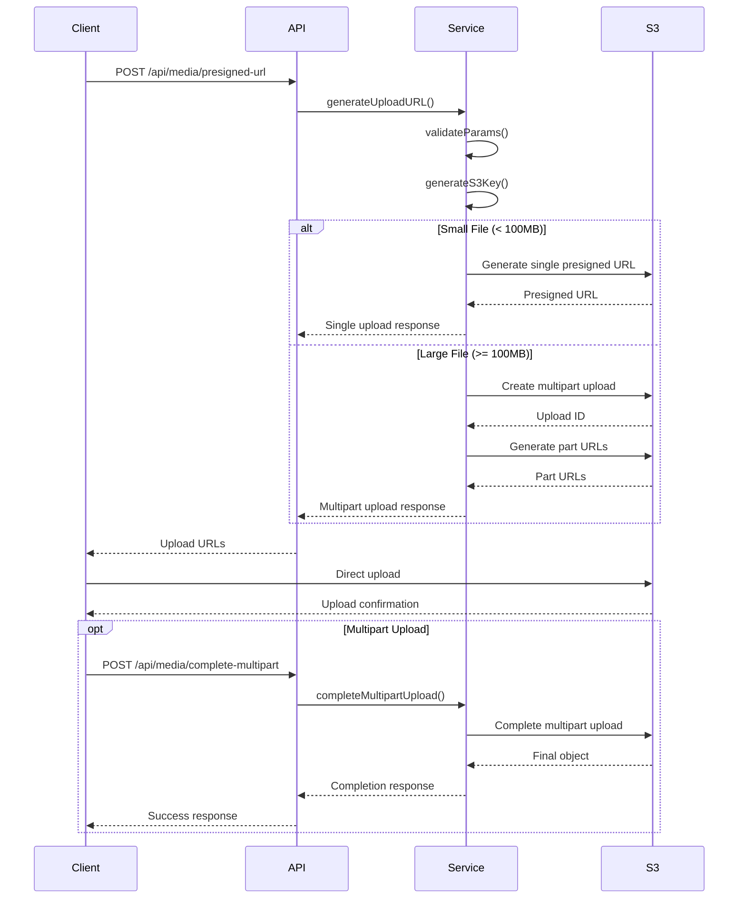

# Presigned URL Service Documentation

## Overview

The Presigned URL Service provides secure direct-to-S3 uploads with comprehensive features including multipart uploads, resumable uploads, and tenant-based isolation. This service is designed to handle large file uploads efficiently while maintaining security and performance.

## Features

- **Direct S3 Uploads**: Generate presigned URLs for secure direct uploads to S3
- **Multipart Upload Support**: Automatic multipart uploads for files larger than 100MB
- **Resumable Uploads**: Support for resumable upload sessions for large files
- **Tenant Isolation**: Secure tenant-based S3 key generation and access control
- **File Validation**: Comprehensive validation of file types, sizes, and filenames
- **Security**: Protection against malicious filenames and unauthorized access

## Architecture

### Service Components

1. **PresignedURLService**: Core service class handling all upload operations
2. **API Endpoints**: RESTful endpoints for client interaction
3. **Validation Layer**: Comprehensive input validation and security checks
4. **S3 Integration**: Direct integration with AWS S3 using AWS SDK v3

### File Upload Flow



## API Endpoints

### 1. Generate Presigned URL

**Endpoint**: `POST /api/media/presigned-url`

**Headers**:
```
Authorization: Bearer <jwt-token>
Content-Type: application/json
```

**Request Body**:
```json
{
  "originalName": "example-file.jpg",
  "contentType": "image/jpeg",
  "size": 2048576,
  "metadata": {
    "description": "User uploaded image",
    "category": "profile"
  }
}
```

**Response (Single Upload)**:
```json
{
  "success": true,
  "data": {
    "uploadType": "single",
    "uploadUrl": "https://bucket.s3.amazonaws.com/...",
    "s3Key": "tenants/tenant-123/users/user-456/media/...",
    "bucket": "media-bucket",
    "expiresIn": 300,
    "metadata": {
      "tenant-id": "tenant-123",
      "user-id": "user-456",
      "original-name": "example-file.jpg"
    }
  }
}
```

**Response (Multipart Upload)**:
```json
{
  "success": true,
  "data": {
    "uploadType": "multipart",
    "uploadId": "upload-id-123",
    "s3Key": "tenants/tenant-123/users/user-456/media/...",
    "bucket": "media-bucket",
    "partSize": 5242880,
    "partCount": 40,
    "partUrls": [
      {
        "partNumber": 1,
        "uploadUrl": "https://bucket.s3.amazonaws.com/...",
        "minSize": 5242880,
        "maxSize": 5242880
      }
    ],
    "expiresIn": 300,
    "completeUrl": "/api/media/complete-multipart",
    "abortUrl": "/api/media/abort-multipart"
  }
}
```

### 2. Complete Multipart Upload

**Endpoint**: `POST /api/media/complete-multipart`

**Request Body**:
```json
{
  "s3Key": "tenants/tenant-123/users/user-456/media/...",
  "uploadId": "upload-id-123",
  "parts": [
    {
      "PartNumber": 1,
      "ETag": "\"etag-value-1\""
    },
    {
      "PartNumber": 2,
      "ETag": "\"etag-value-2\""
    }
  ]
}
```

**Response**:
```json
{
  "success": true,
  "data": {
    "s3Key": "tenants/tenant-123/users/user-456/media/...",
    "bucket": "media-bucket",
    "location": "https://bucket.s3.amazonaws.com/...",
    "etag": "\"final-etag\"",
    "versionId": "version-123"
  }
}
```

### 3. Abort Multipart Upload

**Endpoint**: `POST /api/media/abort-multipart`

**Request Body**:
```json
{
  "s3Key": "tenants/tenant-123/users/user-456/media/...",
  "uploadId": "upload-id-123"
}
```

### 4. Create Resumable Session

**Endpoint**: `POST /api/media/resumable-session`

**Request Body**:
```json
{
  "originalName": "large-video.mp4",
  "contentType": "video/mp4",
  "size": 524288000,
  "metadata": {
    "description": "Marketing video"
  }
}
```

**Response**:
```json
{
  "success": true,
  "data": {
    "sessionId": "session-uuid",
    "s3Key": "tenants/tenant-123/users/user-456/media/...",
    "resumable": true,
    "chunkSize": 5242880,
    "totalChunks": 100,
    "expiresIn": 86400,
    "uploadUrl": "/api/media/resumable-upload/session-uuid",
    "statusUrl": "/api/media/resumable-status/session-uuid"
  }
}
```

## Configuration

### Environment Variables

```bash
# AWS Configuration
AWS_REGION=us-east-1
AWS_ACCESS_KEY_ID=your-access-key
AWS_SECRET_ACCESS_KEY=your-secret-key
MEDIA_BUCKET=your-media-bucket

# Service Configuration
MULTIPART_THRESHOLD=104857600  # 100MB
MAX_FILE_SIZE=5368709120       # 5GB
DEFAULT_EXPIRATION=300         # 5 minutes
```

### Supported File Types

The service supports the following MIME types:

**Images**:
- `image/jpeg`, `image/jpg`, `image/png`, `image/gif`
- `image/webp`, `image/svg+xml`

**Videos**:
- `video/mp4`, `video/mpeg`, `video/quicktime`
- `video/webm`, `video/x-msvideo`

**Audio**:
- `audio/mpeg`, `audio/wav`, `audio/ogg`, `audio/mp3`

**Documents**:
- `application/pdf`, `text/plain`, `text/csv`
- Microsoft Office formats (Word, Excel, PowerPoint)

## Security Features

### Tenant Isolation

Files are stored with tenant-based S3 keys:
```
tenants/{tenantId}/users/{userId}/media/{timestamp}-{randomId}-{filename}
```

### Filename Validation

The service protects against:
- Directory traversal attacks (`../`)
- Invalid characters (`<>:"|?*`)
- Windows reserved names (`CON`, `PRN`, `AUX`, etc.)
- Hidden files (starting with `.`)
- Executable files (`.exe`, `.bat`, `.cmd`, etc.)

### Access Control

- JWT token validation for all requests
- Tenant-based access control for multipart operations
- Presigned URL expiration (default 5 minutes)
- File size limits (default 5GB maximum)

## Usage Examples

### Single File Upload

```javascript
// 1. Get presigned URL
const response = await fetch('/api/media/presigned-url', {
  method: 'POST',
  headers: {
    'Authorization': `Bearer ${token}`,
    'Content-Type': 'application/json'
  },
  body: JSON.stringify({
    originalName: 'profile.jpg',
    contentType: 'image/jpeg',
    size: 2048576
  })
});

const { data } = await response.json();

// 2. Upload directly to S3
await fetch(data.uploadUrl, {
  method: 'PUT',
  headers: {
    'Content-Type': 'image/jpeg'
  },
  body: fileBuffer
});
```

### Multipart Upload

```javascript
// 1. Get multipart upload URLs
const response = await fetch('/api/media/presigned-url', {
  method: 'POST',
  headers: {
    'Authorization': `Bearer ${token}`,
    'Content-Type': 'application/json'
  },
  body: JSON.stringify({
    originalName: 'large-video.mp4',
    contentType: 'video/mp4',
    size: 209715200 // 200MB
  })
});

const { data } = await response.json();

// 2. Upload each part
const uploadedParts = [];
for (const part of data.partUrls) {
  const partResponse = await fetch(part.uploadUrl, {
    method: 'PUT',
    body: getPartData(part.partNumber, data.partSize)
  });
  
  uploadedParts.push({
    PartNumber: part.partNumber,
    ETag: partResponse.headers.get('etag')
  });
}

// 3. Complete multipart upload
await fetch('/api/media/complete-multipart', {
  method: 'POST',
  headers: {
    'Authorization': `Bearer ${token}`,
    'Content-Type': 'application/json'
  },
  body: JSON.stringify({
    s3Key: data.s3Key,
    uploadId: data.uploadId,
    parts: uploadedParts
  })
});
```

## Error Handling

### Common Error Responses

**401 Unauthorized**:
```json
{
  "error": "Unauthorized",
  "message": "Authentication token is required"
}
```

**400 Bad Request**:
```json
{
  "error": "Bad Request",
  "message": "File type application/x-executable is not allowed"
}
```

**500 Internal Server Error**:
```json
{
  "error": "Internal Server Error",
  "message": "Failed to generate presigned URL"
}
```

### Error Categories

1. **Authentication Errors**: Invalid or missing JWT tokens
2. **Validation Errors**: Invalid file types, sizes, or filenames
3. **Authorization Errors**: Tenant access violations
4. **Service Errors**: AWS S3 service issues

## Testing

### Running Tests

```bash
# Run service tests
npm test -- tests/services/PresignedURLService.test.js --run

# Run API tests
npm test -- tests/api/presigned-url.test.js --run

# Run all tests
npm test --run
```

### Test Coverage

The test suite covers:
- Single and multipart upload URL generation
- Parameter validation and security checks
- Tenant isolation and access control
- Error handling and edge cases
- API endpoint functionality

## Performance Considerations

### File Size Thresholds

- **Small files (< 100MB)**: Single upload for optimal performance
- **Large files (≥ 100MB)**: Automatic multipart upload
- **Maximum file size**: 5GB (configurable)

### Presigned URL Expiration

- **Default expiration**: 5 minutes for security
- **Resumable uploads**: 24 hours for long-running uploads
- **Configurable**: Adjust based on use case requirements

### S3 Optimization

- **Multipart uploads**: Parallel part uploads for better performance
- **Server-side encryption**: AES256 encryption for all uploads
- **Intelligent tiering**: Automatic cost optimization (configured separately)

## Monitoring and Logging

### Logging

The service logs:
- Upload request details (file name, size, user, tenant)
- Multipart upload completion/abortion
- Error conditions and validation failures

### Metrics

Key metrics to monitor:
- Upload success/failure rates
- Average upload times
- File size distributions
- Error rates by type

## Future Enhancements

### Planned Features

1. **Progress Tracking**: Real-time upload progress for large files
2. **Virus Scanning**: Integration with antivirus scanning services
3. **Image Processing**: Automatic thumbnail generation and optimization
4. **CDN Integration**: CloudFront signed URLs for secure content delivery
5. **Webhook Support**: Upload completion notifications

### Scalability Improvements

1. **Redis Integration**: Session storage for resumable uploads
2. **Queue Processing**: Asynchronous upload processing
3. **Rate Limiting**: Per-tenant upload rate limits
4. **Caching**: Presigned URL caching for repeated requests

## Troubleshooting

### Common Issues

**Issue**: "File type not allowed"
- **Solution**: Check the `allowedMimeTypes` configuration
- **Prevention**: Validate file types on the client side

**Issue**: "Invalid filename detected"
- **Solution**: Sanitize filenames before upload
- **Prevention**: Use filename validation on the client side

**Issue**: "Unauthorized access to upload"
- **Solution**: Ensure tenant ID matches the S3 key prefix
- **Prevention**: Validate tenant context in middleware

**Issue**: "Presigned URL expired"
- **Solution**: Generate a new presigned URL
- **Prevention**: Implement retry logic with exponential backoff

### Debug Mode

Enable debug logging by setting:
```bash
DEBUG=presigned-url-service
```

This will provide detailed logging of:
- Parameter validation steps
- S3 key generation process
- AWS SDK interactions
- Error stack traces